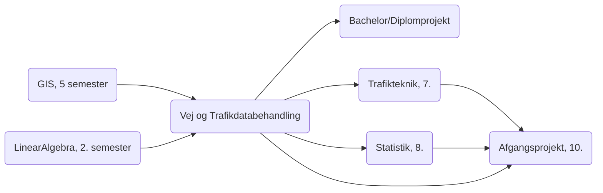

# Vej- og Trafikdatabehandling 6. semester

Et repository der indeholder python and sql øvelser for Vej- og trafikdatabehandling on AAU Build

## Integration med andre kurser

```mermaid
flowchart LR;

a(GIS, 5 semester);
b(LinearAlgebra, 2. semester);
c(Vej og Trafikdatabehandling);
d(Bachelor/Diplomprojekt);
e(Trafikteknik, 7.);
f(Statistik, 8.);
g(Afgangsprojekt, 10.);

a-->c;
b-->c;
c-->d;
c-->e;
c-->f;
e-->g;
f-->g;
c-->g;
```
