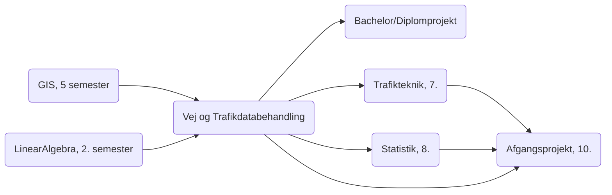

# Vej- og Trafikdatabehandling 6. semester

Et repository der indeholder python and sql øvelser for Vej- og trafikdatabehandling on AAU Build

## Integration med andre kurser

## [Fra studieordningen](https://moduler.aau.dk/course/2020-2021/B-VT-B6-10)

### LÆRINGSMÅL

#### VIDEN
Studerende, der har gennemført modulet:

* Skal have kendskab til centrale begreber inden for datastruktur og dataorganisering
* Skal have kendskab til centrale elementer inden for opbygning af databaser
* Skal have kendskab til grundlæggende håndtering af datastrømme relateret til databaser
* Skal have kendskab til det officielle Danmarks databasesystemer om veje og trafik
* Skal kunne gøre rede for spatiale analyser af trafikale forhold ved anvendelse af GIS

#### FÆRDIGHEDER
Studerende, der har gennemført modulet:

* Skal kunne definere og foretage databaseudtræk med SQL
* Skal kunne bearbejde databaseudtræk og præsentere resultaterne
* Skal kunne anvende et eller flere gængse programmeringssprog

#### KOMPETENCER
Studerende, der har gennemført modulet:

* Skal kunne vurdere muligheder og begrænsninger ved anvendelse af forskellige værktøjer
* Skal kunne vurdere datagrundlaget for at kunne udføre spatiale analyser
* Skal kunne beskrive et typisk udviklingsforløb inden for spatiale analyser

#### UNDERVISNINGSFORM
Forelæsninger og undervisning i form af ”flipped classroom” suppleret med øvelser, selvstudier og evt. workshops.

#### OMFANG OG FORVENTET ARBEJDSINDSATS
Kursusmodulets omfang er 5 ECTS svarende til 150 timers studieindsats.

### EKSAMEN
PRØVER

|   |   |   
|---:|---|
| Prøvens navn |	Vej- og trafikdatabehandling |
| Prøveform    | Skriftlig eller mundtlig Individuel mundtlig eller skriftlig prøve. Prøveformen fastsættes ved semesterstart. |
|  ECTS |  5 |   
| Bedømmelsesform  | Bestået/ikke bestået  |
|  Censur | Intern prøve  |
| Vurderingskriterier  | Vurderingskriterierne er angivet i Universitetets eksamensordning  |

---

# Forventninger til forberedelse

Kursusgangene vil fungere efter tankerne i flipped classroom. Der vil således være materiale der skal læses/ses/øves før og efter kursusgangene.

På den enkelte kursusgang vil der være et kort oplæg fra underviser, med plads til spørgsmål og derefter fokus opgaveløsning.

Det er en forudsætning for at løse opgaverne, at selvstudierne er gennemført

Opgavernes løsning vil danne baggrund for den mundtlige eksamen.

Kurset er fordelt på 10 kursusgange af 3.5 timer.
