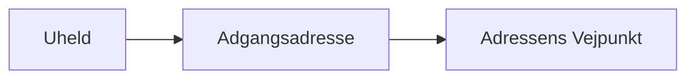

# Danmarks Adressers Web API

## Opgave

1. Før i starter på at kode, så tænk over hvilke dele programmet skal bestå af. Beskriv det i koden i en kommentar.
2. Skriv koden der laver mapmatchingen. Husk kun at gøre det på et lille sample under udviklingen.

