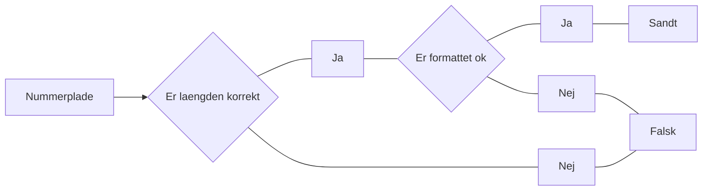

# ComputerVision til udtræk af data fra billedeoptagelser

Tilgængeligheden af forskellige computervision algoritmer er de senere år eksploderet.

Dette gør det idag er blevet meget nemt at behandle data indhentet fra filmoptagelser i virkeligheden.
Indenfor trafik området er især en type analyse benyttet: nummerplade analyser.

Tidligere har nummerpladeanalyser kun kunne laves ved at manuelt at registrere nummerplader på et
bestemt sted i en tidsrum afhængig af økonomi og mandskab. I dag foregår nummerskrivningsanalyser
typisk ved at opstille et kamera, der kan optage timer og dages trafik. Herfra kan man ved hjælp af ComputerVision udtrække nummerplade oplysninger.

Nummerplade analyser bruges ofte til at stedfæste om en given bil har været til stede i et punkt.

I denne opgave har vi kørt denne video gennem et computervision system og fået et datasæt ud på 1035 rækker. Der skal skrives en række funktioner, der kan validere outputtet og filtrere dette sæt.

I finder pladelib.py, hvor logikken til de enkelte funktioner skal skrives, nedestående flowchart beskriver ligeledes flowet af pladelib.py

## 1. Udfyld de angivne funktioner i pladelib.py

I pladelib finder i 4 funktioner, den ene samler de to andre og main() står for at gøre pladelib.py til et program der også kan bruges selvstændigt.

## 2. Udfyld funktionerne I alpr_analysis.py

I denne opgave, skal vi vores bibliotek pladelib.py importeres, hvor vi så har adgang til is_plate_ok() funktionen. Denne bruger vi til at validere vores input fil.

Vi skal kunne bruge alpr_analysis.py dynamisk, så vi fremadrettet nemt kan bede om at få behandlet en ny input.csv fil.
