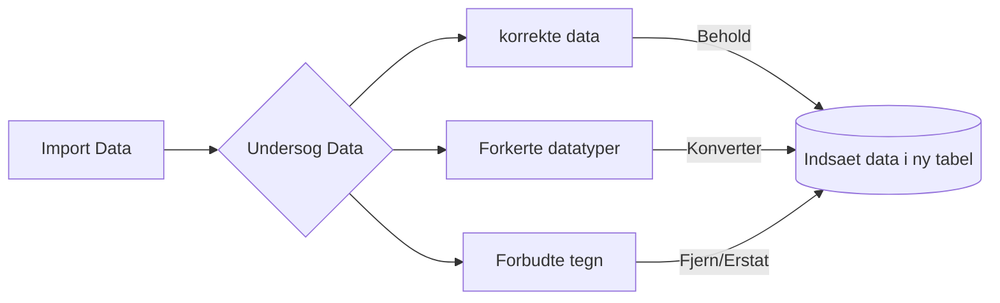

# Uheldsdata i databaser

En stor del af trafiksikkerhedsarbejdet er arbejdet med uheldsdata. Den officielle uheldsstatistik laves med uheldsdata fra Politiets registreringer der kan findes i vejman.dk.

Trafikforskningsgruppen, har et mål om at få afdækket uheld bredere end politiet data. Det sker bl.a. ved at kigge på landpatientregistret.

I skal forestille jer at data er kommet fra et andet system, hvor der ikke har været krav til datatyperne. Derfor skal i først importere jeres data til jeres database, lave udtræk der identificere fejl og lave en datavask for derefter at konvertere dem til korrekte datatyper. Når data er korrekte, så kan der laves nogle statistiske udtræk.
BEMÆRK: Med udgangspunkt i uheld fra 2008-2014, er der genereret et datasæt, hvor alder og dato er randomiseret, ligeledes er placeringen ikke korrekte.

I skal i denne opgave arbejde i pgAdmin, nedeståend flow diagram, opsumere delopgave 1-3.


## 1. Åben filen PycharmProjects/VTT6/uheld/uheld_loesning.sql i pgAdmin
 - Denne fil skal i skrive jeres løsning i

## 2. Indsæt data fra uheld_fake.csv filen
- 2a. Opret tabellen hvor data skal importeres:
- 2b. Import din CSV fil

```sql
CREATE TABLE uheldsdata_import (
	id serial primary key,
	egenpart varchar(255),
	dato varchar(255),
	alder varchar(255),
	x varchar(255),
	y varchar(255)
);
```

```sql
COPY uheldsdata_import (egenpart, dato, alder, x, y)
FROM '/fullpath/to/your/PycharmProjects/VTT6/uheld/data/uheld_fake.csv'
DELIMITER ',' csv header;
```

## 3. Få et overblik over dine data
Spørg jer selv:
-  Bør datatyperne være sat anderledes end varchar?
-  Hvad bør ændes?


## 4. Rens data
- 4a. Opret en ny tabel, kaldet uheldsdata, (se spg 1) med de korrekte datatyper
- 4b. Indsæt data fra uheldsdata_import
- 4c. Der Mangler et uheld, indsæt dette: Egenparten 16 år gammel har den 21. august 2012 styrtet på knallert på 555675.17,6322592.93


## 5. Lidt statistik
- 5a. Hvor mange uheld var der i 2009
- 5b. Hvordan er de fordelt på egenpart, og hvad er gennemsnitalderen


## 6. Bearbejd data af hensyn til alder
- 6a. Opdater uheldstabellen med aldersintervaller i intervallerne 0-15, 16-17, 18-24, 25-34, 35-44, 45-54, 55-64, 65-74, 75-84 og 85+
- 6b. Hvor mange uheld er der i hvertfald interval og hvad er gennemsnitsalderen samt 10 og 90 % fraktilen


## 7. Bearbejde data af hensyn til egenpart = Pedestrian with counterpart
- 7a. Gentag spørgsmål 5b. men kun hvor egenpart er Pedestrian with counterpart


## 8. Gruppering af uheld
- 8a. Find steder hvor der sker mindst 3 uheld med max 50 meter mellem hvert uheld
- 8b. Find centroiden for grupperne
